# Eufy Vacuum Manager

A custom Home Assistant integration that adds room-level control, queue management, a learning/ETA system, automation events, and a built-in Lovelace panel card to your Eufy vacuum. These capabilities are not available in the standard Eufy integration.

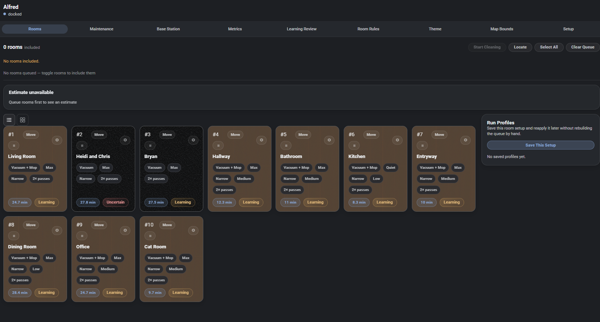

*Each room remembers its own profile, learned timing, and floor type. Save the whole layout as a Run Profile and reapply it later from the UI or an automation.*

## What it does

[eufy-clean by jeppesens](https://github.com/jeppesens/eufy-clean) exposes basic start/stop/pause and a few entity states. This integration goes further:

- **Room-level control** — select individual rooms by name and send targeted clean jobs, rather than cleaning the whole floor.
- **Queue management** — build, inspect, and reorder a cleaning queue before the job starts.
- **Run profiles and room profiles** — save vacuum settings (suction, mop, passes) per-room or as named run profiles you can trigger from automations or the UI.
- **Room rules** — attach per-room rules (e.g. mop-only, skip when occupied) that are applied automatically when a job is built.
- **Learning system and ETA** — the integration records how long each room takes and uses that data to estimate job completion times. Estimates improve with each run.
- **Stall detection** — fires a Home Assistant event when the vacuum has been in a room significantly longer than its learned average.
- **Battery health tracking** — cumulative cycle counter, zone-aware charge rate tracking (low / high / mid-job), per-job drain rates (%/min, %/hour, %/m²), and a baseline-relative health proxy. Surfaces ten sensors plus a dedicated **Metrics → Battery** sub-tab. Spots a degrading battery 6-12 months before it impacts cleaning.
- **Automation events** — exposes `eufy_vacuum_job_finished`, `eufy_vacuum_room_started`, `eufy_vacuum_room_finished`, `eufy_vacuum_path_blocked`, `eufy_vacuum_stall_detected`, and `eufy_vacuum_run_incomplete` events for use in automations.
- **Theme system** — a built-in theme editor for the panel card, with save/load/import/export support.
- **Built-in Lovelace panel card** — the integration registers its own dashboard panel. No separate card repository or manual resource registration is needed.

## Tested hardware

| Model | Status |
|---|---|
| Eufy X10 Pro Omni | Tested |
| Other Eufy models | Untested — may work, not supported |

If you run this on another model, please [open an issue](https://github.com/kingchddg901/eufy-vacuum-manager/issues) with the model name and what worked or didn't — the table grows from there.

## Prerequisites

- Home Assistant 2024.1.0 or later
- Your Eufy vacuum must already be set up and working in Home Assistant via [eufy-clean by jeppesens](https://github.com/jeppesens/eufy-clean) (the integration that provides the `vacuum.*` entity). This integration does not replace it — it builds on top of it.

## Installation via HACS

1. In Home Assistant, open **HACS** and go to **Integrations**.
2. Click the three-dot menu (top right) and choose **Custom repositories**.
3. Add `https://github.com/kingchddg901/eufy-vacuum-manager` as an **Integration** type repository.
4. Search for **Eufy Vacuum Manager** in HACS and install it.
5. Restart Home Assistant.
6. Go to **Settings → Devices & Services → Add Integration** and search for **Eufy Vacuum Manager** to complete setup.
7. A **Eufy Vacuum** item will appear in your sidebar. The panel card is registered automatically — no manual dashboard editing required.

## What's included

- The `eufy_vacuum` custom integration (services, events, data layer).
- A Lovelace panel card served directly from the integration. No separate HACS frontend repository and no manual resource registration needed.

## Screenshots

<strong>Click to expand the full panel tour</strong>

### Maintenance

Track filter, brush, mop, and dock-water status against the integration's maintenance intervals.

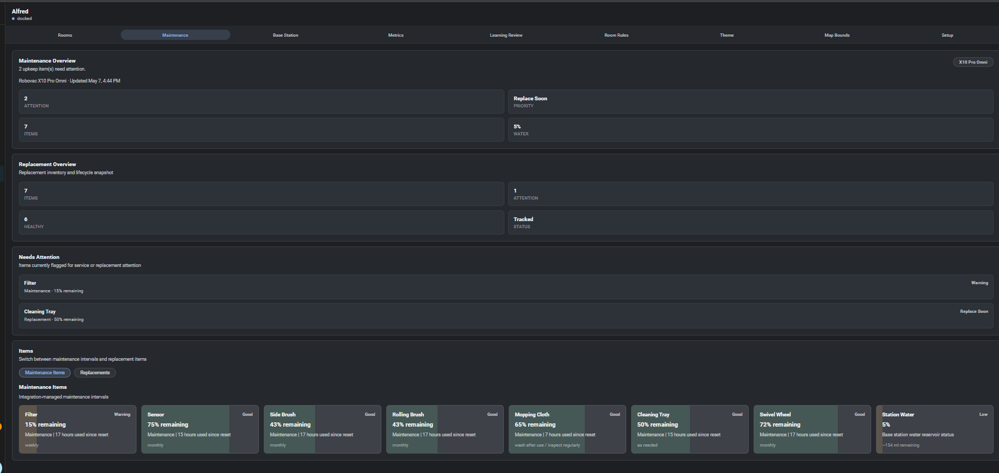

### Base Station

Live dock state, water reservoir projection, and gated dock actions (wash mop, dry mop, empty dust).

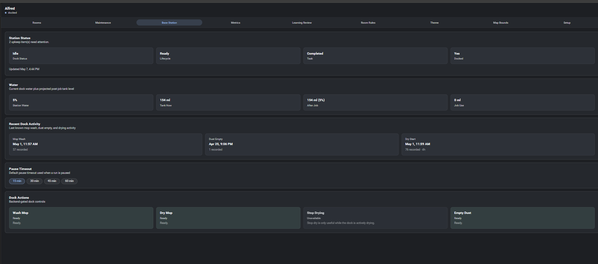

### Metrics

Job and learning history, filtered by room, profile, status, or learning use.

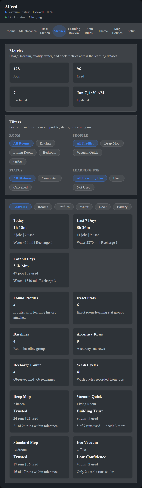

### Metrics — Battery

Cycle count, zone-aware charge rates (low / high / mid-job), per-job drain rates (%/min, %/hour, %/m²), and per-mode aggregates from single-bucket jobs. Pointer to the raw CSV / JSONL files for long-term review.

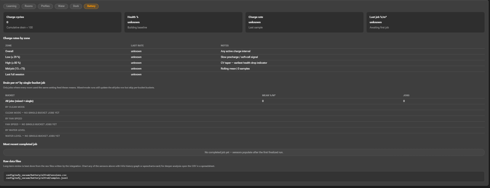

### Learning Review

Inspect every recorded run, exclude outliers (test runs, false completions, bad room attribution), and see which profiles match the current settings.

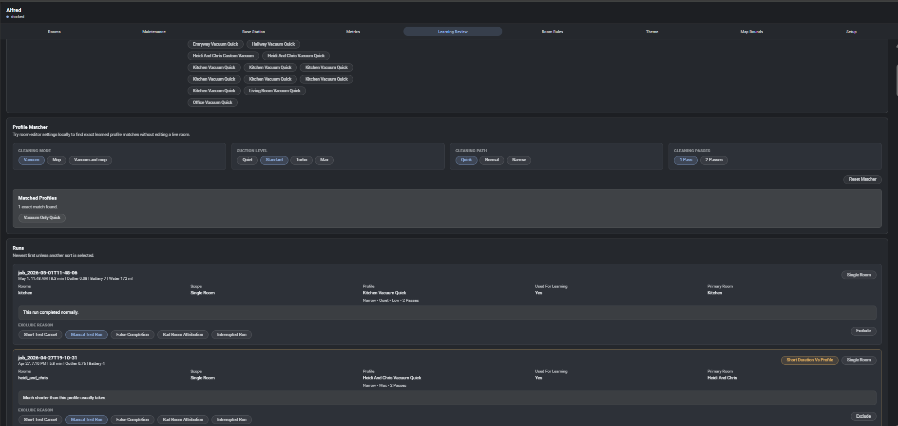

### Room Rules

Per-room blocker and modifier rules driven by any Home Assistant entity — skip a room when a door is open, switch profiles when occupancy changes, etc.

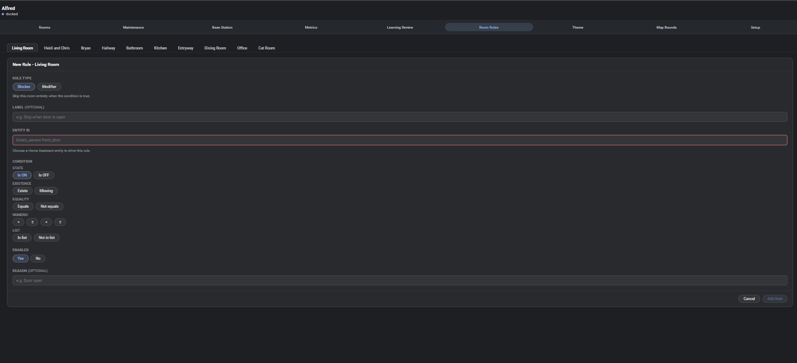

### Themes

Built-in theme editor with three layers: ready-made presets, a palette editor for high-level colors, and full token-level control with live previews.

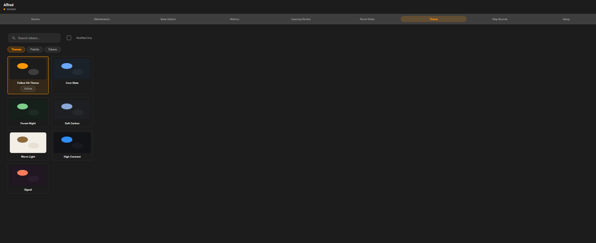
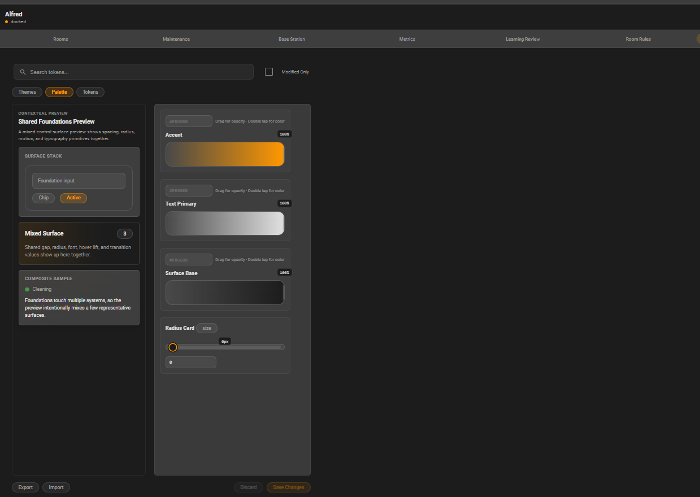
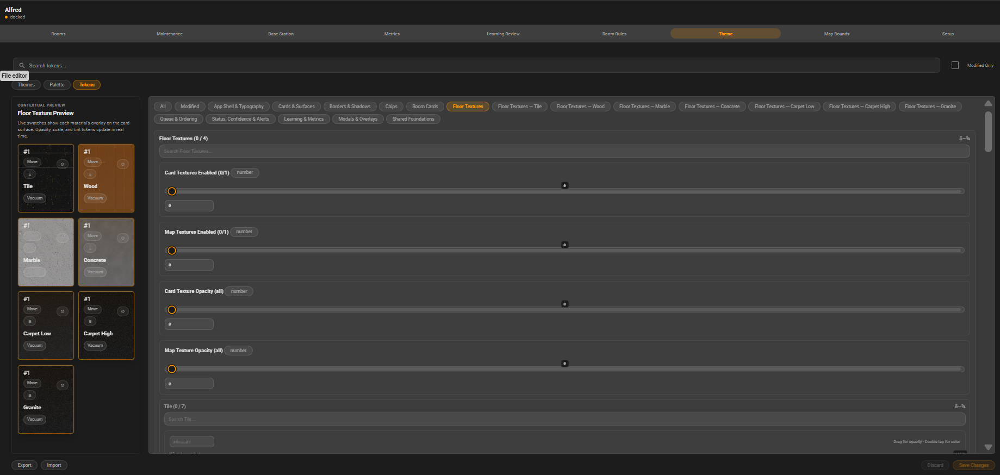

### Map Bounds

Per-room bounding-box review across runs, with outlier detection so a single bad run doesn't poison your learned bounds.

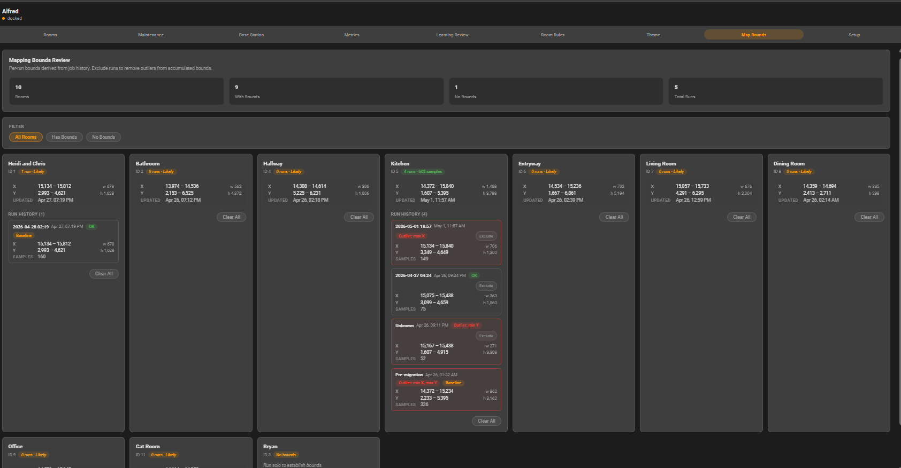

### Setup

Register the vacuum, import maps, and configure each room — exclude ghost rooms, set floor type per room (drives the cleaning profile system).

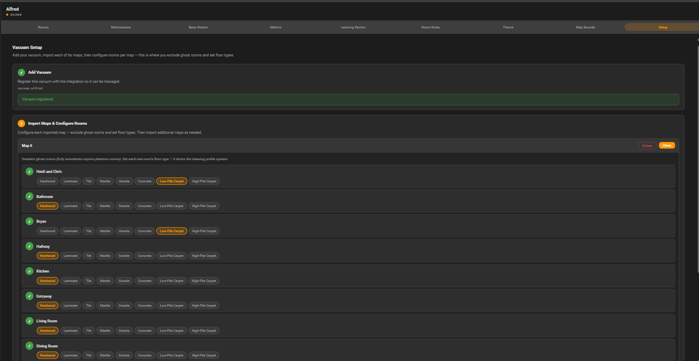

### Interactive room map (optional)

Tap a room on a live floor-plan view to queue it; double-tap to configure. **This view is not enabled by default** and requires a one-time configuration step — see [Map Configuration](docs/advanced/08-map-configuration.md) for setup.

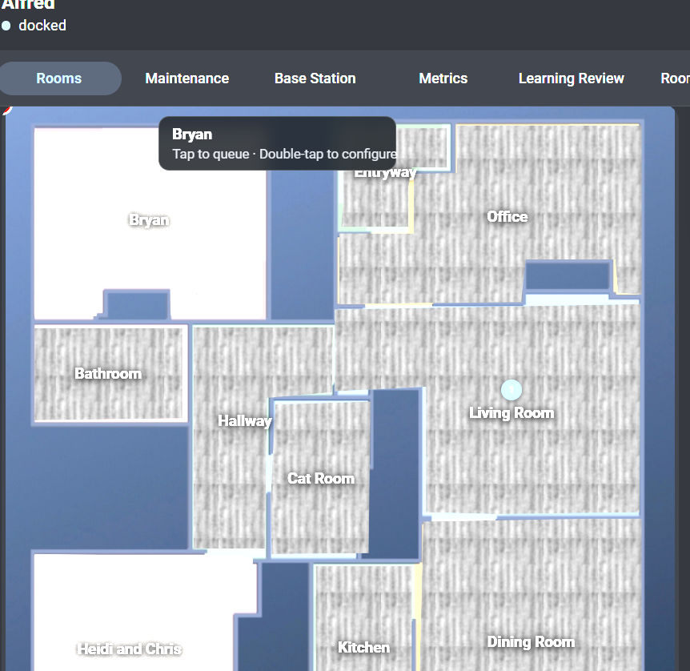

## Feature summary

- Room selection and targeted clean jobs
- Cleaning queue — build, reorder, inspect before starting
- Room profiles — per-room suction, mop, and pass settings
- Run profiles — named full-run configurations, triggerable from automations
- Room rules — conditional per-room behavior
- Learning system — records per-room timing, improves ETA estimates over time
- ETA display — estimated completion time shown in the panel
- Stall detection — event fired when a room takes significantly longer than learned average
- Battery health — cycle counter, zone-aware charge rates, per-job drain efficiency, baseline-relative health proxy
- Automation events — job, room, stall, path-blocked, and incomplete-run events
- Dock actions — wash mop, dry mop, empty dust bin (model-dependent)
- Maintenance tracking — reset maintenance counters from the UI
- Theme system — full theme editor with save/load/import/export

## Documentation

- [User guide](docs/user-guide/01-overview.md) — walk-through of every panel tab
- [Battery health](docs/user-guide/13-battery-health.md) — what's tracked, the ten sensors, charting, raw CSV/JSONL access
- [Services reference](docs/advanced/03-services.md) — for use in automations
- [Automation examples](docs/advanced/04-automation-examples.md)
- [Map configuration](docs/advanced/08-map-configuration.md) — enable the interactive room map (optional)
- [Battery health (advanced)](docs/advanced/09-battery-health.md) — math, zone definitions, mid-job recharge significance, automation examples
- [Developer docs](docs/dev/architecture-overview.md) — architecture, data model, internals

## Acknowledgements

This integration would not exist without [eufy-clean](https://github.com/jeppesens/eufy-clean) by jeppesens and its contributors. Their work reverse-engineering the Eufy protocol and maintaining the HA integration that bridges the vacuum to Home Assistant is the foundation everything here is built on. If you find this useful, go give their repo a star too.

## Licence

MIT — you are free to fork and adapt this work without attribution to this repository.

One condition: this project is a top-level addition built on [eufy-clean](https://github.com/jeppesens/eufy-clean). Any fork or derivative work must maintain acknowledgement of that dependency. See [LICENSE](LICENSE) for full terms.

## Issues

Please report bugs and feature requests at: <https://github.com/kingchddg901/eufy-vacuum-manager/issues>
