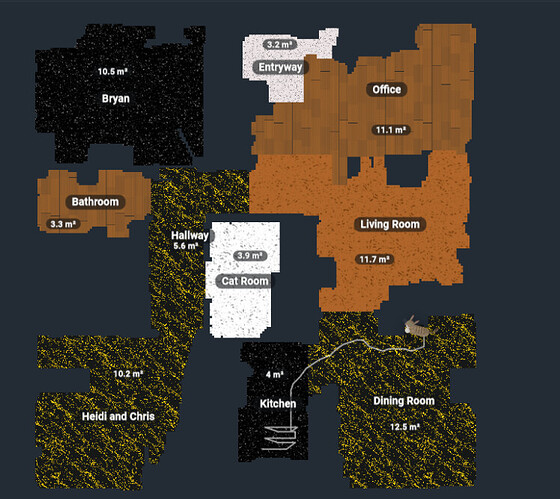
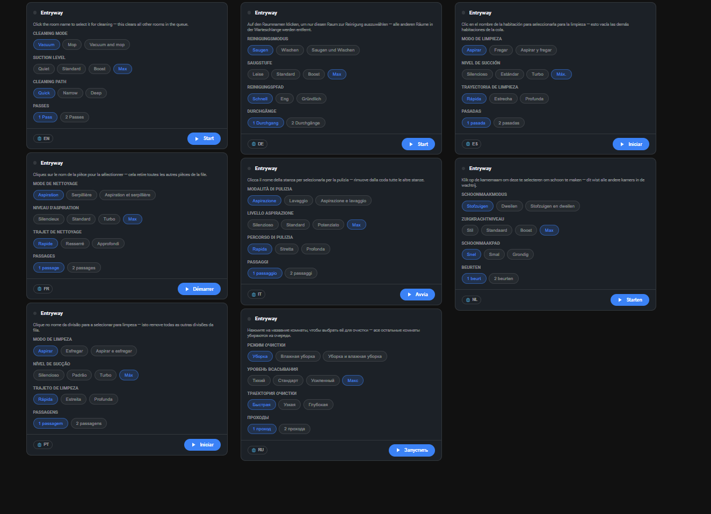
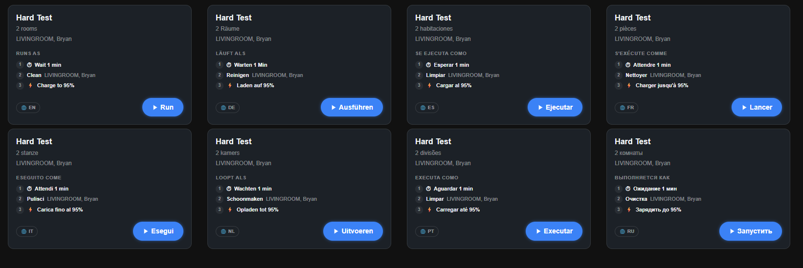
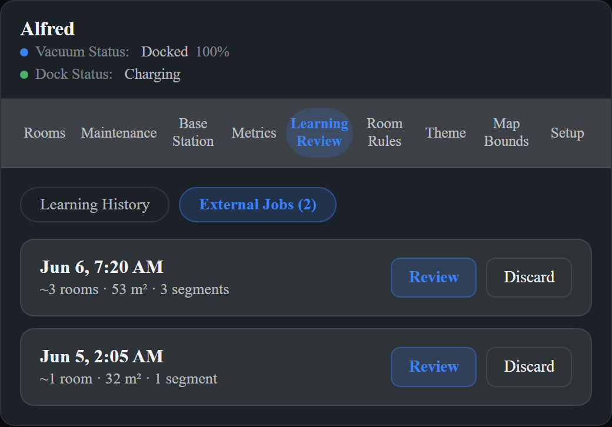
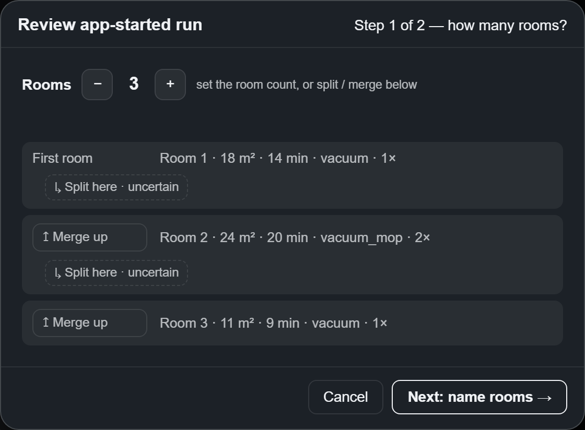
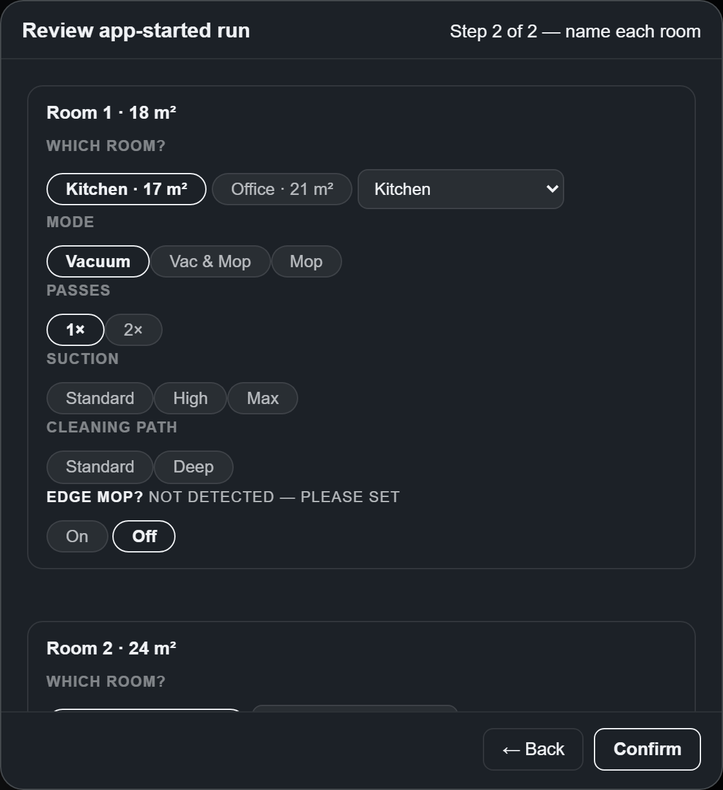

# Vacuum Agent

A custom Home Assistant integration that adds a whole control-and-intelligence layer on top of your robot vacuum — **room-level cleaning, a live map you can actually drive from, a learning/ETA system, saved zones, battery-health tracking, a themeable dashboard, seven languages, and automation events** — for **Eufy** *and* **Roborock**. It uses an adapter pattern, so more brands can follow.

*Every room painted with its real floor material — wood, marble, granite, tile, carpet — rendered live over your robot's actual map.*

It doesn't replace your vacuum integration, it builds on it: for **Eufy** that's [eufy-clean by jeppesens](https://github.com/jeppesens/eufy-clean); for **Roborock**, Home Assistant's built-in Roborock integration. Vacuum Agent consumes whatever they already expose and adds everything the stock integrations don't.

---

## The map is the centerpiece

Put your robot's live map on the dashboard, then actually work from it:

- **Tap a room** to queue it.
- **Draw a box** to clean just that spot — no rooms to set up first — and **save those boxes as named zones** you reuse later (see [Saved zones](#saved-zones)).
- **Rotate** the map to match how your home is actually oriented, and mask sensor noise with hide-areas.
- **Floor textures** — paint every room with its real material (wood planks, tile + grout, carpet, marble, concrete, granite) as one continuous, themeable floor. It reads like a floor plan of *your* house, and every material's colours and a **Map Texture Rotation** are tunable in the theme editor.
- **Custom room colours** — give any room its own fill colour, or recolour the whole room palette from the theme editor.
- **Furnished render** — trace your real rooms, drop in a to-scale drawing of your home, and align it once so the robot, dock, and cleaning path drive across your actual furniture (Live / Blend / Art view modes).

## Per-room control that learns

- **Room-level control** — select individual rooms by name and send targeted clean jobs, rather than cleaning the whole floor.
- **Queue management** — build, inspect, and reorder a cleaning queue before the job starts.
- **Run profiles and room profiles** — save vacuum settings (suction, mop, passes) per-room or as named run profiles you trigger from the UI or an automation.
- **Room rules** — attach per-room rules (e.g. mop-only, skip when occupied) that apply automatically when a job is built, driven by any Home Assistant entity.
- **Learning system and ETA** — records how long each room actually takes and uses that to estimate completion; estimates improve with every run. Cleans you start from the **vendor app** are captured and folded into learning too.
- **Stall detection** — fires a Home Assistant event when the vacuum has been in a room significantly longer than its learned average.
- **Room drift detection** — watches for new rooms the vacuum reports after setup, and for configured rooms that stop being reported, surfacing both for one-click review; permanently suppresses phantom rooms so they never become managed entities.

## Saved zones

Beyond one-off box-cleaning, **draw a zone, name it, and file it under a room** — then re-clean it any time. A collapsible **Saved Zones** panel lets you multi-select several, apply shared suction/mop settings, and clean the whole selection at once (e.g. a *stove area* filed under the Kitchen). Six services back it for automations: `create_saved_zone`, `rename_saved_zone`, `delete_saved_zone`, `set_saved_zone_room`, `clean_saved_zone`, and `clean_saved_zones`.

## Battery health you can trend

Cumulative cycle counter, zone-aware charge-rate tracking (low / high / mid-job), CC/CV charge-speed indices, per-job drain rates (%/min, %/hour, %/m²), and a baseline-relative health proxy — built to spot degradation trends **6–12 months** before they impact cleaning.

## Make it yours — themes & languages

A built-in **theme editor** for the panel card, with three layers: ready-made presets, a high-level palette editor, and full token-level control with live previews (including every floor material). Export/import via clipboard or file to share themes or migrate between installs. There's a validated **colorblind-safe** theme plus always-on shape-coded status badges.

The card **speaks seven languages** out of the box — German, French, Spanish, Dutch, Italian, Portuguese, Russian — via a per-user language globe in the header, plus drop-in support for your own locale. A pack follows your Home Assistant language automatically **once it's promoted to `stable`** (after native review); until then, pick it from the globe. Anything untranslated falls back to English. (Native reviewers very welcome — see the [translations discussion](https://github.com/kingchddg901/Vacuum_Agent/discussions/25).)

The proof is the everyday surfaces themselves — a room's own controls and a saved routine's step-by-step plan — rendered in every shipped language:

## Also on Roborock

The Roborock adapter (tested on the **S6**) brings the stock integration up to parity with Eufy: the same per-room **rendered map**, **floor textures**, tap-to-queue, **draggable room-name labels**, and **draw-a-zone** — plus native per-room live rollover and per-room fan speed. Where a brand doesn't expose a fan-speed select entity, suction is still settable right in the zone/clean panel.

## Automation events

Wire the vacuum into the rest of your home. Vacuum Agent fires `eufy_vacuum_job_finished`, `eufy_vacuum_room_started`, `eufy_vacuum_room_finished`, `eufy_vacuum_room_skipped`, `eufy_vacuum_path_blocked`, `eufy_vacuum_stall_detected`, and `eufy_vacuum_run_incomplete` for use in automations. Run/room profiles and zone cleans are triggerable straight from automations and scripts too.

## Where it lives

- **Built-in Lovelace panel card** — the integration registers its own sidebar dashboard panel. No separate card repository or manual resource registration needed.
- **Drop-in dashboard cards** — two compact cards you add to your *own* dashboards from the card picker (no resources to register): **Vacuum Agent — Dashboard Mode** (`vacuum-agent-dashboard`), a multi-room control card (pick rooms + settings, run a saved profile or app scene, embedded map, Start / Dock); and the **Eufy Room Card** (`eufy-room-card`), one card per room. Both carry the language globe, and the embedded map pins its pan/zoom across reloads and lets you drag room-name labels. See [Dashboard & Room cards](https://kingchddg901.github.io/Vacuum_Agent/docs/user-guide/20-dashboard-and-room-cards/).

---

## Tested hardware

| Brand | Model | Status |
|---|---|---|
| Eufy | X10 Pro Omni | Tested — Eufy adapter reference |
| Eufy | Other models | Untested — may work, not supported |
| Roborock | S6 | Tested — Roborock adapter reference |
| Roborock | Other models | Untested — may work, not supported |

Each brand's adapter was built and validated against one **reference model** — the **Eufy X10 Pro Omni** and the **Roborock S6**. Those are the devices the adapter's behavior is tested against; other models of the same brand reuse that adapter and frequently work, but aren't individually verified.

If you run this on another model, please [open an issue](https://github.com/kingchddg901/Vacuum_Agent/issues) with the model name and what worked or didn't — the table grows from there.

### Eufy: which models Vacuum Agent can drive

Vacuum Agent's value — per-room cleaning, the live map, room rollover, and the learning/ETA system — all depend on the robot building a **room map with per-room segments**, delivered over Eufy's **MQTT** transport. If your robot doesn't map rooms, Vacuum Agent has nothing to add.

**Not supported — basic navigation robots (no map, no rooms).** These bump-and-go and gyroscopic-navigation models never build a room map, so per-room cleaning, the map view, and learning simply don't apply. They work fine in [eufy-clean](https://github.com/jeppesens/eufy-clean) on their own for start/stop, suction and status — use it directly:

- **RoboVac C-series** — 11C, 11S, 15C / 15C MAX, 25C, 30C / 30C MAX, 35C
- **RoboVac G-series** — G10 Hybrid, G20 / G20 Hybrid, G30 (incl. Verge / Hybrid / +SES), G32, G35 / G35+, G40 (incl. Hybrid / Hybrid+), G50

**Transport-dependent — may not work.** The mapping robots — the **X-series** (X8, X9 Pro, X10 Pro Omni), **S1 / S1 Pro**, **L-series** (L60, L70), **LR-series** (LR20 / LR30 / LR35), **Omni C20** and **AE C10** — build a map and *should* drive Vacuum Agent, but **only when eufy-clean talks to them over MQTT.** eufy-clean v1.12 added a legacy **Tuya** transport (cloud / local) for older robots; on that path the live map and the room list are never sent, so the map and per-room features go dark even on a robot that can map. Only the **X10 Pro Omni** is verified. The rest are unconfirmed — **feel free to test and report back via an [issue](https://github.com/kingchddg901/Vacuum_Agent/issues) and this list will be updated.**

## Prerequisites

Vacuum Agent is a supervisory control layer — it consumes whatever your provider integration already exposes. The only hard requirement is one supported vacuum provider; everything else is capability-dependent.

**Required**

- Home Assistant 2025.6.0 or later
- A working `vacuum.*` entity for your robot, from your brand's upstream integration: [eufy-clean by jeppesens](https://github.com/jeppesens/eufy-clean) for Eufy, or Home Assistant's built-in **Roborock** integration for Roborock. Vacuum Agent builds on top of it — it doesn't replace it.

**Optional** *(Vacuum Agent works without these — they unlock extra capabilities)*

- A provider **map / camera / image entity** for the live-map backdrop and richer map views (including the rendered floor-texture map). On **Eufy** this comes from **eufy-clean v1.11.1 or later**, which renders the robot's map as a `camera.<device>_map` entity; on **Roborock** it's the built-in integration's map image. Without it, room control, queues, and profiles still work — you just don't get the live backdrop or the map-based tools.
- The Python science stack (**numpy, Pillow, scipy**) for **Auto (CV) map segmentation** — bundled in Home Assistant OS, but not always present on Container / Core / Supervised installs. Without it, Auto (CV) is hidden and you set rooms up manually (draw bounds with primitive shapes, or compose over a live/custom map — a few minutes in the editor). Manual setup is fully supported and is the source of truth; it is never required to install or load the integration.
- Brand-specific **companion entities** (dock, station, etc.) for richer controls and status.

## Installation via HACS

1. In Home Assistant, open **HACS** and go to **Integrations**.
2. Click the three-dot menu (top right) and choose **Custom repositories**.
3. Add `https://github.com/kingchddg901/Vacuum_Agent` as an **Integration** type repository.
4. Search for **Vacuum Agent** in HACS and install it.
5. Restart Home Assistant.
6. Go to **Settings → Devices & Services → Add Integration** and search for **Vacuum Agent**.
7. In the setup form, **pick your vacuum entity** from the **Vacuum** dropdown. This is the `vacuum.*` entity provided by your brand's upstream integration ([eufy-clean](https://github.com/jeppesens/eufy-clean) for Eufy, the built-in Roborock integration for Roborock) — you need that integration installed and working first. The Vacuum field is optional during setup; you can leave it blank now and fill it in later via **Configure**.
8. A **Vacuum Agent** item appears in your sidebar (the default panel title; rename it per-vacuum later). The panel card is registered automatically — no manual dashboard editing required.

If you submitted setup without picking a vacuum, the sidebar entry still appears but shows a "setup needed" placeholder pointing you back to **Settings → Devices & Services → Vacuum Agent → Configure** to add it.

## Configuration

### Setup form (initial install)

| Field | Required | Description |
|---|---|---|
| **Vacuum** | Optional | The `vacuum.*` entity from your brand's upstream integration ([eufy-clean](https://github.com/jeppesens/eufy-clean) for Eufy; the built-in Roborock integration for Roborock). Leave blank to skip for now and set it later via **Configure**. |
| **Tested model** | Required | The model you are setting up. Used to select the correct adapter config and capability declarations. Defaults to the **Eufy X10 Pro Omni**. |
| **Notes** | Optional | Free-form text for your own reference. Shown in the integration entry in **Settings → Devices & Services**. |

### Options flow (Configure button)

After the initial install, open **Settings → Devices & Services → Vacuum Agent → Configure** to update:

| Field | Description |
|---|---|
| **Vacuum** | Change which `vacuum.*` entity the integration manages. |
| **Notes** | Update your notes. |

## Removing the integration

Go to **Settings → Devices & Services**, find **Vacuum Agent**, and delete it. No extra steps are required — all integration data is stored inside Home Assistant and is removed with the entry.

**Remove a single vacuum** (keeping the others): open **Settings → Devices & Services → Vacuum Agent**, click that vacuum's device, and choose **Delete**. Its sidebar panel, entities, and stored data are removed and the other managed vacuums are left untouched. Its learning history and saved map images stay on disk, so re-adding the same vacuum restores them.

Note: this integration sits on top of your provider integration (e.g. [eufy-clean](https://github.com/jeppesens/eufy-clean)), which provides the underlying `vacuum.*` entity. Removing Vacuum Agent does not remove it; remove that separately if you no longer need it.

## What's included

- The `eufy_vacuum` custom integration (services, events, data layer).
- A Lovelace panel card served directly from the integration. No separate HACS frontend repository and no manual resource registration needed.

## Screenshots

> **Live site — [kingchddg901.github.io/Vacuum_Agent](https://kingchddg901.github.io/Vacuum_Agent/):** the project's hub. A [**theme gallery**](https://kingchddg901.github.io/Vacuum_Agent/themes/) renders the *real* card under every community-submitted theme (each tab, the External Jobs subtab, the review wizard); an [**animal gallery**](https://kingchddg901.github.io/Vacuum_Agent/animals/) shows the map companions you can submit — or dedicate to a pet at Rainbow Bridge; and the full [**docs**](https://kingchddg901.github.io/Vacuum_Agent/docs/) live there too. The galleries are rebuilt by the [render harness](https://kingchddg901.github.io/Vacuum_Agent/docs/dev/27-render-harness/) on every push to `master`, so they never go stale — the static tour below is just a quick offline glance.

<strong>Click to expand the full panel tour</strong>

### Maintenance

Track filter, brush, mop, and dock-water status against the integration's maintenance intervals — plus, on devices that report them, lifetime usage totals (area, time, cleans) and the dock firmware version.

### Base Station

Live dock state, water reservoir projection, and gated dock actions (wash mop, dry mop, empty dust).

### Metrics

Job and learning history, filtered by room, profile, status, or learning use.

### Metrics — Battery

Cycle count, zone-aware charge rates (low / high / mid-job), per-job drain rates (%/min, %/hour, %/m²), and per-mode aggregates from single-bucket jobs. Pointer to the raw CSV / JSONL files for long-term review.

### Learning Review

Inspect every recorded run, exclude outliers (test runs, false completions, bad room attribution), and see which profiles match the current settings.

### External Jobs review

Runs you start from the **vendor app** (not just HA-dispatched jobs) are captured and surface here for review — confirm the room count (split or merge the detected cuts), name each room, and correct its settings — so app-started cleans feed learning too.

### Room Rules

Per-room blocker and modifier rules driven by any Home Assistant entity — skip a room when a door is open, switch profiles when occupancy changes, etc.

### Themes

Built-in theme editor with three layers: ready-made presets, a palette editor for high-level colors, and full token-level control with live previews.

### Map Bounds

Per-room bounding-box review across runs, with outlier detection so a single bad run doesn't poison your learned bounds.

### Setup

Register the vacuum, import maps, and configure each room — exclude ghost rooms, set floor type per room (drives the cleaning profile system *and* the floor-texture map). The Setup tab stays useful after the initial wizard: it watches for new rooms the vacuum reports later and for configured rooms that disappear, surfacing both for one-click review.

### Interactive room map (optional)

Tap a room on a live floor-plan view to queue it; double-tap to configure. **This view is not enabled by default** and requires a one-time configuration step — see [Map Configuration](https://kingchddg901.github.io/Vacuum_Agent/docs/advanced/08-map-configuration/) for setup.

## Feature summary

- **Floor-texture map** — each room painted in its real material (wood, tile, marble, concrete, granite, carpet), themeable, on Eufy and Roborock
- Room selection and targeted clean jobs
- Cleaning queue — build, reorder, inspect before starting
- Zone cleaning — draw boxes on the live map and clean just those areas
- **Saved zones** — named, reusable clean zones filed under a room, with per-zone services
- Live map — live backdrop, tap-to-queue rooms, map rotation, hide-areas, and a to-scale furnished-render overlay
- **Custom room colours** — per-room fill colour and a themeable room-fill palette
- Room profiles — per-room suction, mop, and pass settings
- Run profiles — named full-run configurations, triggerable from automations
- Room rules — conditional per-room behavior
- Learning system — records per-room timing, improves ETA estimates over time
- ETA display — estimated completion time shown in the panel
- Stall detection — event fired when a room takes significantly longer than learned average
- Battery health — cycle counter, zone-aware charge rates, per-job drain efficiency, baseline-relative health proxy
- Automation events — job, room, stall, path-blocked, and incomplete-run events
- Dock actions — wash mop, dry mop, empty dust bin (model-dependent)
- Maintenance tracking — reset maintenance counters from the UI; lifetime usage totals and dock firmware where the device reports them
- Room drift detection — auto-surfaces new rooms for review, suppresses phantoms
- Theme system — full theme editor with clipboard and file-based import/export
- Multi-language card — per-user language picker, 7 built-in translations + drop-in locales (English fallback)
- Accessibility — a validated colorblind-safe theme plus always-on shape-coded status badges

## Documentation

Full docs live at **[kingchddg901.github.io/Vacuum_Agent/docs](https://kingchddg901.github.io/Vacuum_Agent/docs/)** — part of the [project site](https://kingchddg901.github.io/Vacuum_Agent/) alongside the theme and animal galleries.

**Using it**

- [User guide](https://kingchddg901.github.io/Vacuum_Agent/docs/user-guide/01-overview/) — a walk-through of every panel tab
- [Setup](https://kingchddg901.github.io/Vacuum_Agent/docs/user-guide/11-setup/) — the initial wizard and ongoing room-drift review
- [Battery health](https://kingchddg901.github.io/Vacuum_Agent/docs/user-guide/13-battery-health/) — what's tracked, the twelve sensors, charting, raw CSV/JSONL access
- [Accessibility](https://kingchddg901.github.io/Vacuum_Agent/docs/user-guide/14-accessibility/) — the colorblind-safe theme and shape-coded badges

**Automations**

- [Services reference](https://kingchddg901.github.io/Vacuum_Agent/docs/advanced/03-services/) · [Automation examples](https://kingchddg901.github.io/Vacuum_Agent/docs/advanced/04-automation-examples/)
- [Map configuration](https://kingchddg901.github.io/Vacuum_Agent/docs/advanced/08-map-configuration/) — enable the optional interactive room map
- [Battery health (advanced)](https://kingchddg901.github.io/Vacuum_Agent/docs/advanced/09-battery-health/) — the math, zone definitions, mid-job recharge significance, and automation examples

**Contributing & internals**

- [Developer docs](https://kingchddg901.github.io/Vacuum_Agent/docs/dev/) — a reading-ordered index of every subsystem deep-dive
- [Porting guide](https://kingchddg901.github.io/Vacuum_Agent/docs/contributing/porting-guide/) — adapting the adapter to other brands (Roborock, Dreame, Narwal, …)
- [Adapter config reference](https://kingchddg901.github.io/Vacuum_Agent/docs/dev/22-adapter-config-reference/) — the per-vacuum brand-config schema
- [Theme authoring](https://kingchddg901.github.io/Vacuum_Agent/docs/contributing/theme-authoring/) · [Animal authoring](https://kingchddg901.github.io/Vacuum_Agent/docs/contributing/animal-authoring/) — submit a card theme or a map companion
- [Translate the card](https://kingchddg901.github.io/Vacuum_Agent/docs/contributing/translating/) — add or fix a language (a translation is data, not code). Start from the [`en.reference.jsonc`](custom_components/eufy_vacuum/frontend/locales/en.reference.jsonc) template — the full key list with a context note per string
- [Render harness](https://kingchddg901.github.io/Vacuum_Agent/docs/dev/27-render-harness/) — headless visual-regression + the live galleries ([how to run](https://kingchddg901.github.io/Vacuum_Agent/docs/testing/07-render-harness/))
- [ha-adapter-pattern](https://github.com/kingchddg901/ha-adapter-pattern) — the runtime-configurable adapter pattern as a standalone, domain-agnostic guide
- [Release checklist](RELEASE_CHECKLIST.md) — the cold-install smoke pass + tag-and-publish ritual

## For developers and porters

Under the hood the integration is **adapter-driven**: every brand-specific fact (entity IDs, vocabulary, dispatch payload shape, dropdown option lists, maintenance components, water-tank measurements, upkeep guides) lives in one per-vacuum adapter config dict. The framework reads from this registry at runtime; no brand assumptions exist in core code.

The Eufy adapter at `custom_components/eufy_vacuum/adapters/eufy/` is the reference implementation. Adding support for a different vacuum brand is a config-only change: write a parallel `adapters/<brand>/` folder, declare what your brand exposes, register the adapter at integration setup. The framework, the card, the learning system, and the dispatch path all consume whatever the adapter declares.

See the [porting guide](https://kingchddg901.github.io/Vacuum_Agent/docs/contributing/porting-guide/) for the vacuum-specific workflow including a four-brand catalog (Eufy, Roborock, Dreame, Narwal) of sample dispatch configs. For the general pattern as a reusable architecture — applicable to any multi-vendor HA integration — see [ha-adapter-pattern](https://github.com/kingchddg901/ha-adapter-pattern).

## Contributors

Built and maintained by [@kingchddg901](https://github.com/kingchddg901), with contributions from the community:

- [@Nebr88](https://github.com/Nebr88) (Andrey Dmitriyev) — Roborock adapter fixes: clean-duration and live-room tracking ([#19](https://github.com/kingchddg901/Vacuum_Agent/pull/19)) and unnamed-map imports ([#18](https://github.com/kingchddg901/Vacuum_Agent/pull/18)).

**Translations.** The seven built-in language packs — German, French, Spanish, Dutch, Italian, Portuguese, and Russian — are AI-drafted and ship as `draft` until a native speaker reviews them (a `draft` pack never auto-activates from your Home Assistant language; you pick it from the globe). Corrections, promotions to `stable`, and brand-new locales are all welcome — start in the [translation discussion](https://github.com/kingchddg901/Vacuum_Agent/discussions/25) or follow the [Translate the card](https://kingchddg901.github.io/Vacuum_Agent/docs/contributing/translating/) guide (a translation is data, not code). Community translators are credited here.

## Acknowledgements

This integration would not exist without [eufy-clean](https://github.com/jeppesens/eufy-clean) by jeppesens and its contributors. Their work reverse-engineering the Eufy protocol and maintaining the HA integration that bridges the vacuum to Home Assistant is the foundation everything here is built on. If you find this useful, go give their repo a star too.

Vacuum Agent's Roborock support builds on Home Assistant's built-in [Roborock integration](https://www.home-assistant.io/integrations/roborock/) and its maintainers — their work bringing Roborock's maps, rooms, and cleaning controls into Home Assistant core is what the Roborock adapter stands on.

## Licence

MIT — you are free to fork and adapt this work without attribution to this repository.

One condition: this project is a top-level addition built on [eufy-clean](https://github.com/jeppesens/eufy-clean). Any fork or derivative work must maintain acknowledgement of that dependency. See [LICENSE](LICENSE) for full terms.

## Issues

Please report bugs and feature requests at: <https://github.com/kingchddg901/Vacuum_Agent/issues>
