# One maintenance guide, eighteen languages

The filter's care card, in every language Vacuum Agent ships. It is here rather than in
the README because eighteen screenshots is a gallery, not an argument.

**This is the deep end of the translation work, not the shallow one.** Chips and buttons
are single words with obvious equivalents. This card is *prose* — five ordered care steps
and two warnings — plus a health readout, an editable interval with its own units, and a
reset. Getting it right means translating instructions someone follows with the machine
in front of them.

Three details worth looking for, because they are the ones a translation gets wrong when
it is only string substitution:

* **Turkish puts the percent sign first.** English reads `100% remaining`; Turkish reads
  `%100 kaldı`. The sign precedes the number, which no amount of `{value}%` templating
  gets right on its own.
* **The hour unit localises, not just the words around it.** English `Default 20h · Max
  120h` becomes Turkish `Varsayılan 20sa · En fazla 120sa` (*saat*) and Arabic
  `الافتراضي 20س · الحد الأقصى 120س` (*ساعة*).
* **Hebrew and Arabic mirror the whole card** — title and close button swap sides, the
  numbered steps right-align while keeping their numbering, and the interval row reverses
  so Save and Default sit to the left of the field.

Room names are absent here by design: this card describes a part, not a place.

Ordered as the in-app language menu orders them — English first, then by each language's
own name for itself, which is why Korean precedes Japanese.

### 1. English — English

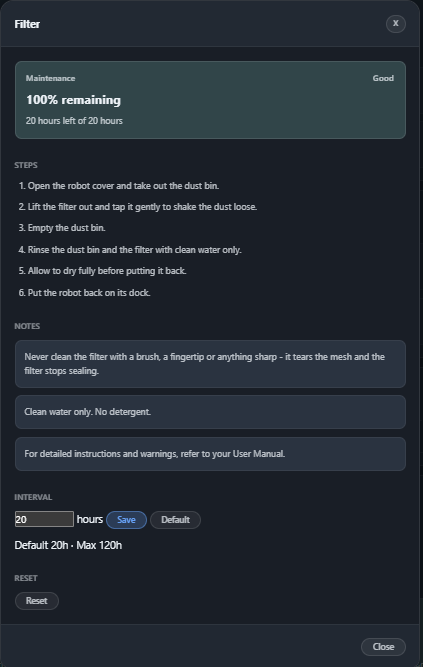

### 2. Bahasa Indonesia — Indonesian

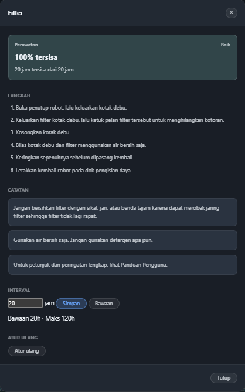

### 3. Čeština — Czech

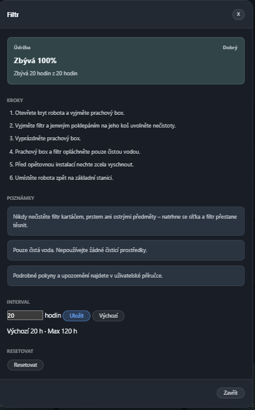

### 4. Deutsch — German

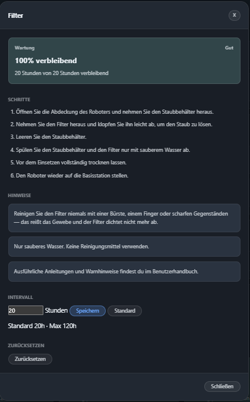

### 5. Español — Spanish

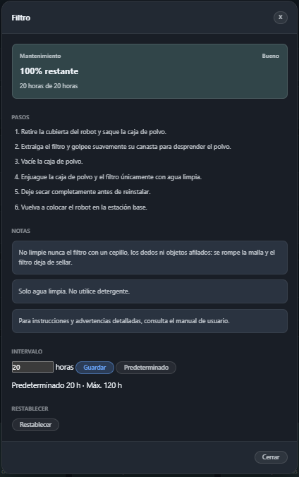

### 6. Français — French

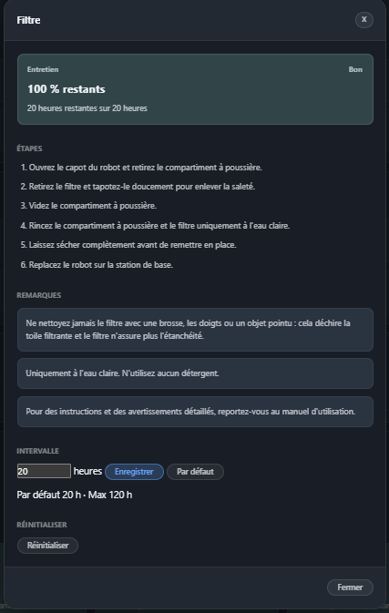

### 7. Italiano — Italian

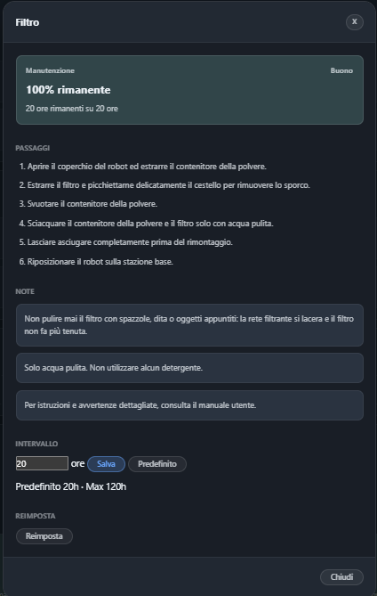

### 8. Nederlands — Dutch

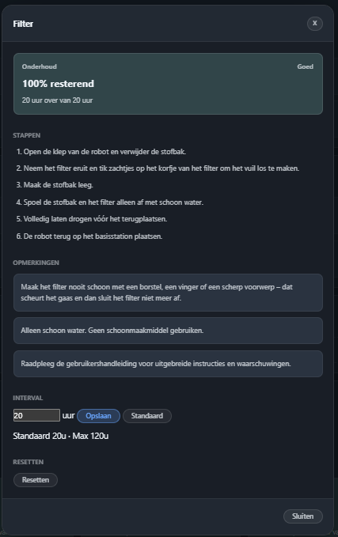

### 9. Polski — Polish

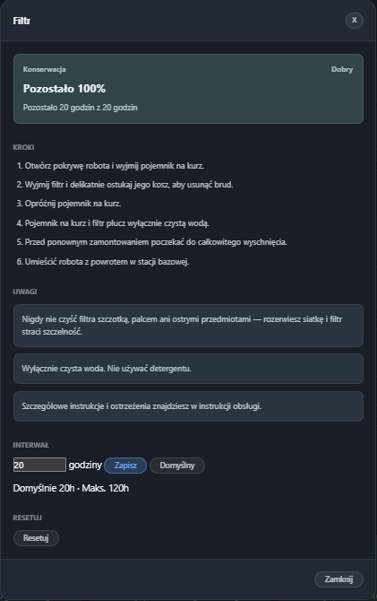

### 10. Português — Portuguese

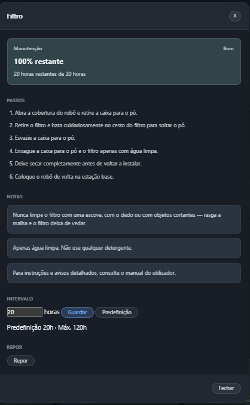

### 11. Türkçe — Turkish

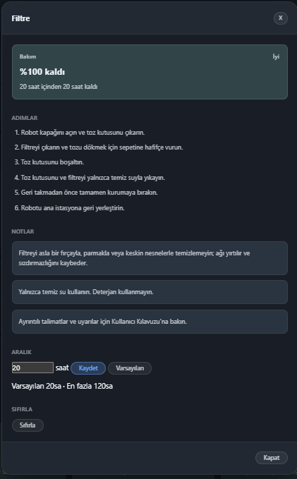

### 12. Русский — Russian

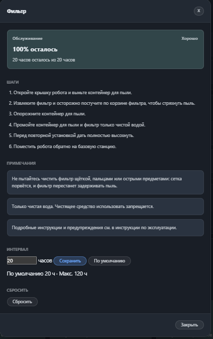

### 13. עברית — Hebrew

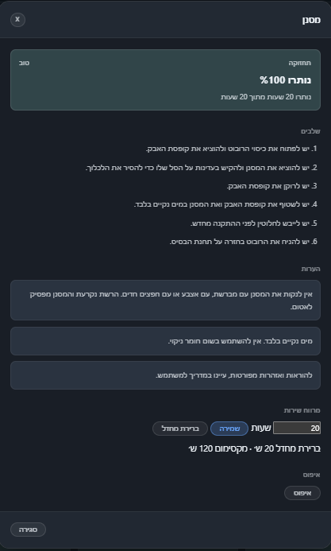

### 14. العربية — Arabic

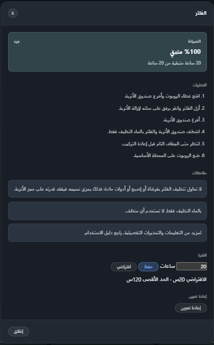

### 15. 한국어 — Korean

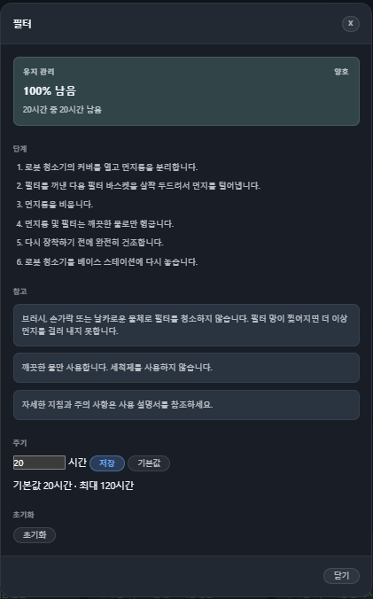

### 16. 日本語 — Japanese

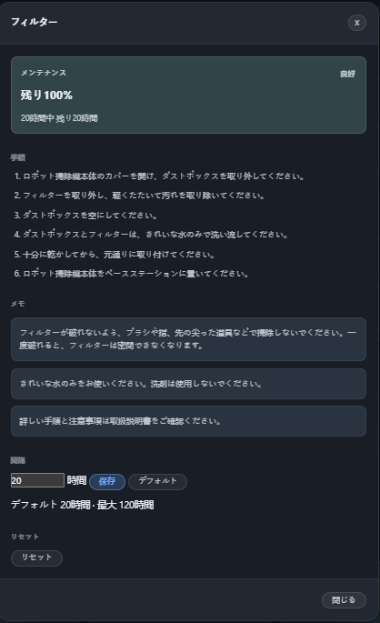

### 17. 简体中文 — Simplified Chinese

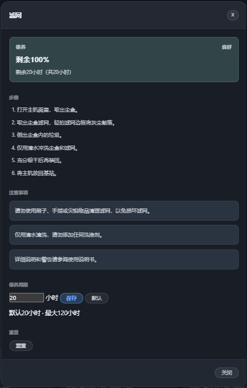

### 18. 繁體中文 — Traditional Chinese

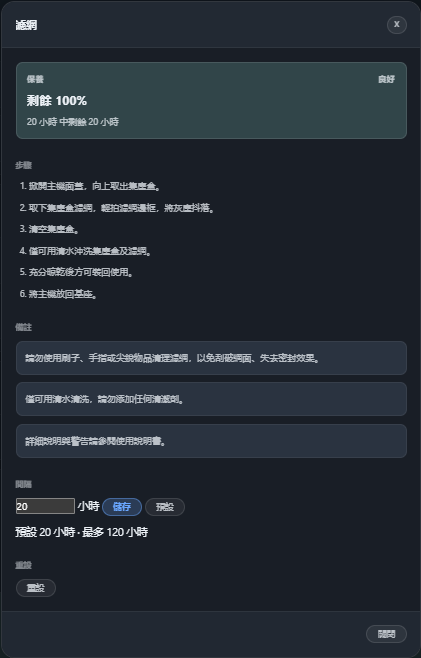
